# Pengenalan Sistem Operasi & Instalasi

## 1.10. Latihan

### Latihan 1.1
Jelaskan 5 fungsi utama sistem operasi dengan contoh konkret dari minimal 2 OS berbeda (Windows, macOS, atau Linux).

### Latihan 1.2
Kapan sebaiknya menggunakan Windows vs Linux vs macOS? Analisis
berdasarkan use case: gaming, development, server, creative work, dan enterprise.

### Latihan 1.3
Install Ubuntu Server 22.04 LTS di VirtualBox dengan langkah berikut:
1. Download Ubuntu Server ISO dari website resmi
2. Create VM baru di VirtualBox (RAM: 2GB, Disk: 25GB)
3. Install dengan automatic partitioning (guided)
4. Buat user account dengan password yang kuat
5. Reboot dan login ke sistem
6. Dokumentasikan proses instalasi dengan screenshot key steps

### Install Ubuntu Server 22.04 LTS di VirtualBox
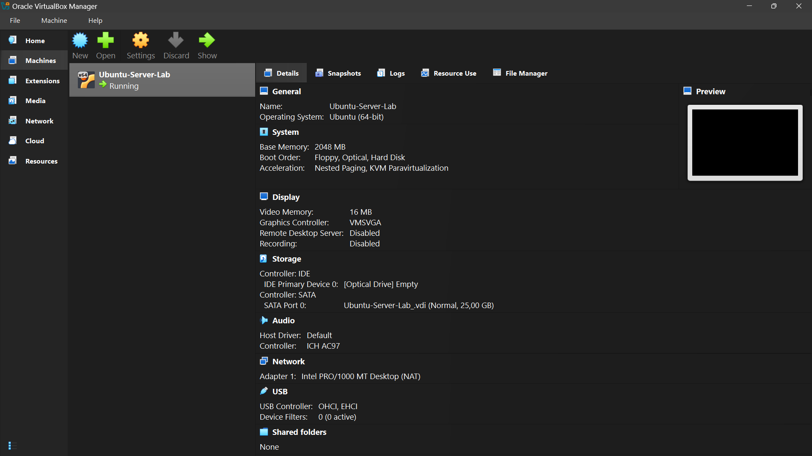
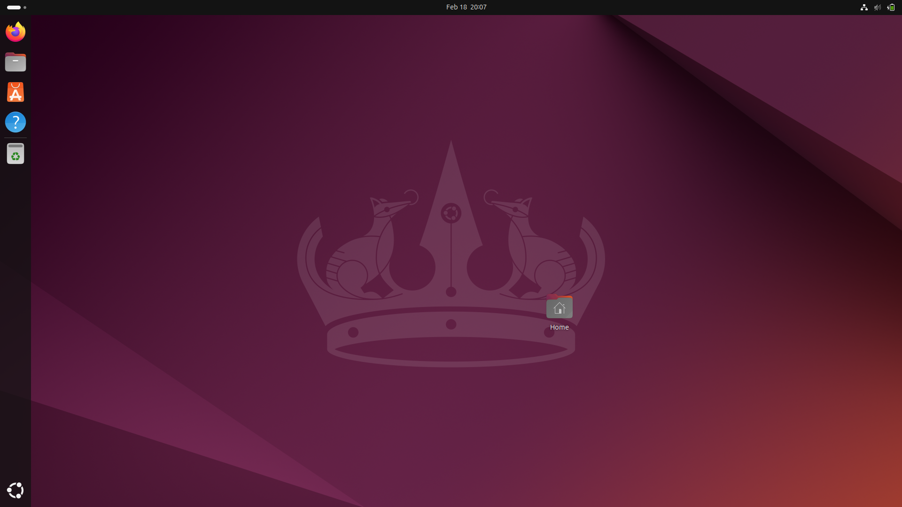

### Latihan 1.4
Setelah instalasi Ubuntu Server, lakukan tasks berikut:
1. Update package list: sudo apt update
2. Upgrade packages: sudo apt upgrade
3. Install neofetch: sudo apt install neofetch
4. Jalankan neofetch dan screenshot hasilnya
5. Check disk usage dengan df -h
6. Check memory dengan free -h
7. Dokumentasikan output dari setiap command

### Dokumentasi Latihan 1.4

#### 1. sudo apt update
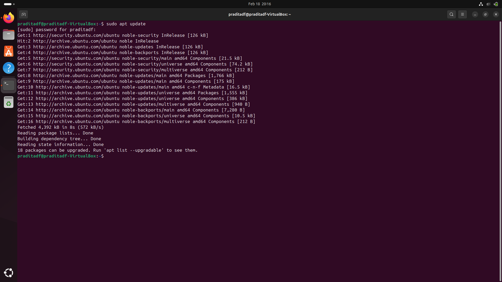
#### 2. sudo apt upgrade
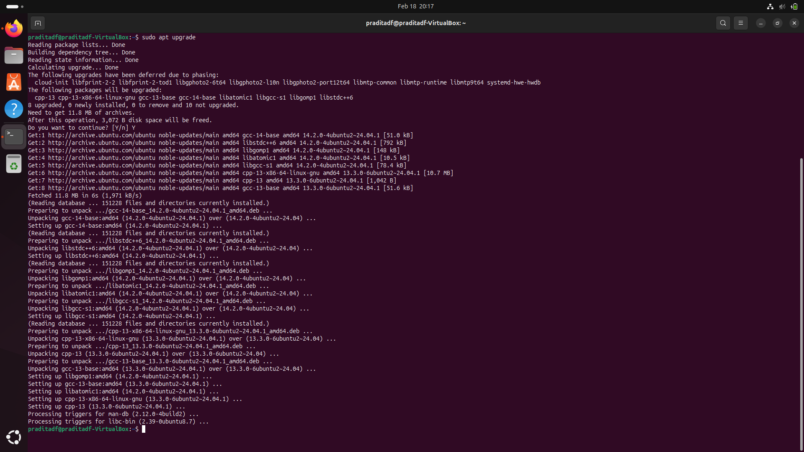
#### 3. sudo apt install neofetch
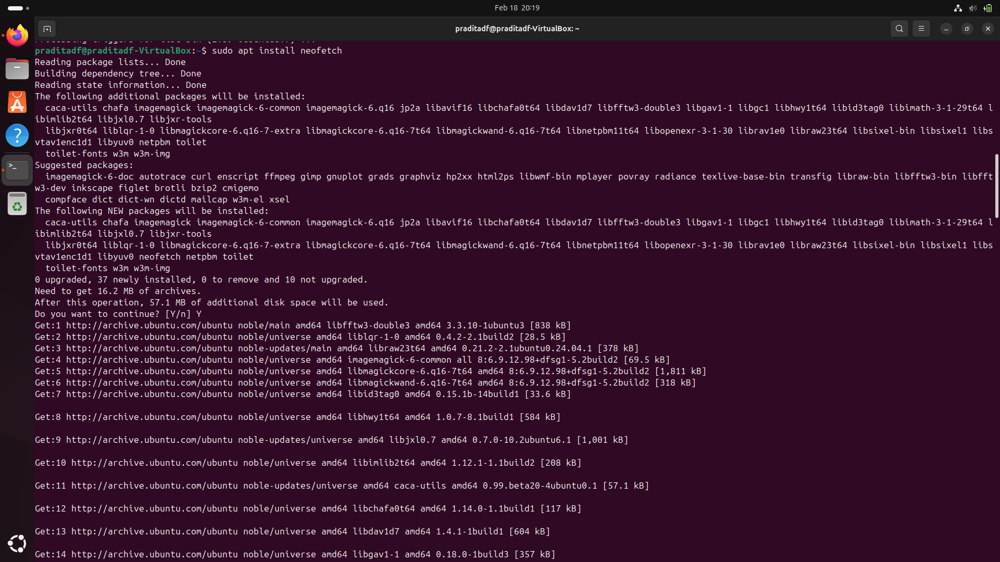
#### 4. neofetch
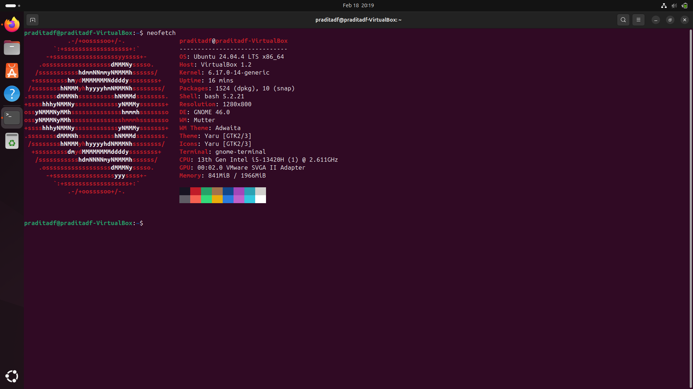
#### 5. df -h
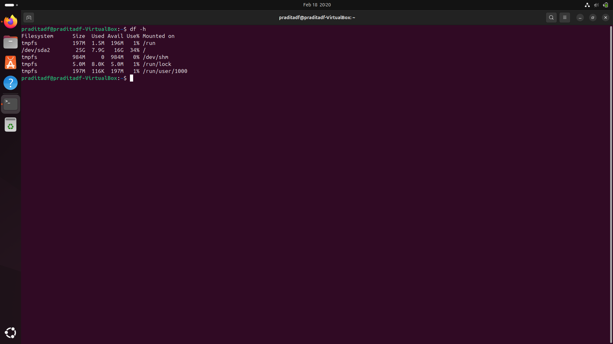
#### 6. free -h
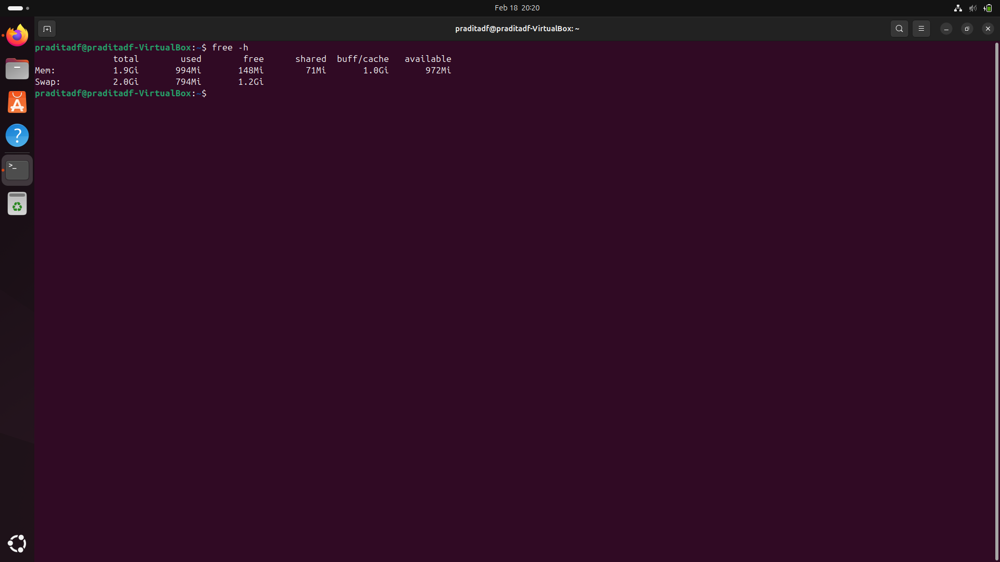

### Latihan 1.5
Eksplorasi sistem yang baru diinstall:
1. Tampilkan informasi OS: cat /etc/os-release
2. Tampilkan versi kernel: uname -r
3. List partisi: lsblk
4. Check network connectivity: ping -c 4 google.com
5. Install dan jalankan htop untuk melihat resource usage
6. Buat laporan singkat tentang konfigurasi sistem Anda

### Laporan Latihan 1.5

#### 1. cat /etc/os-release
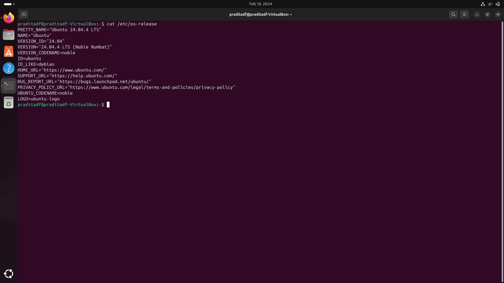
#### 2. uname -r
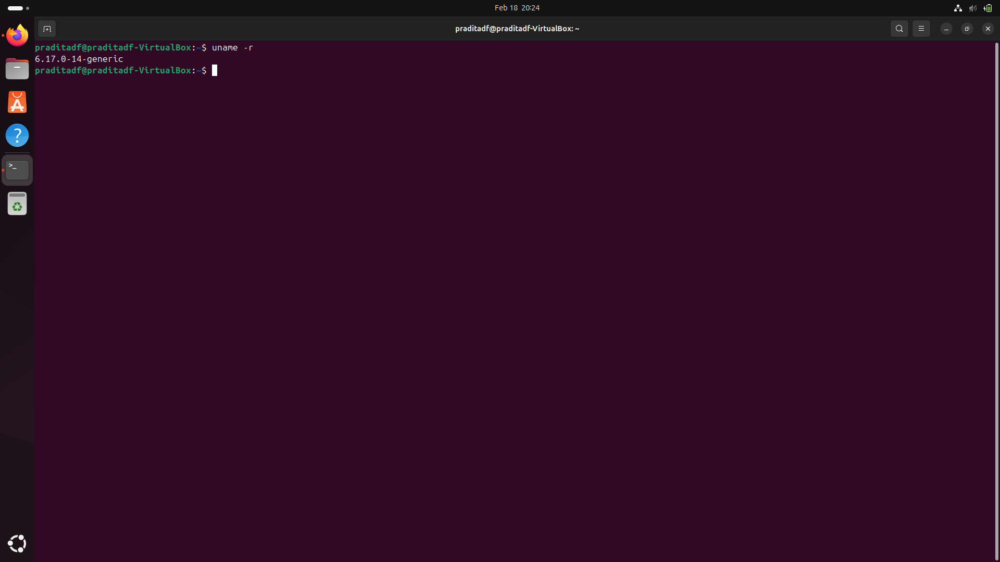
#### 3. lsblk
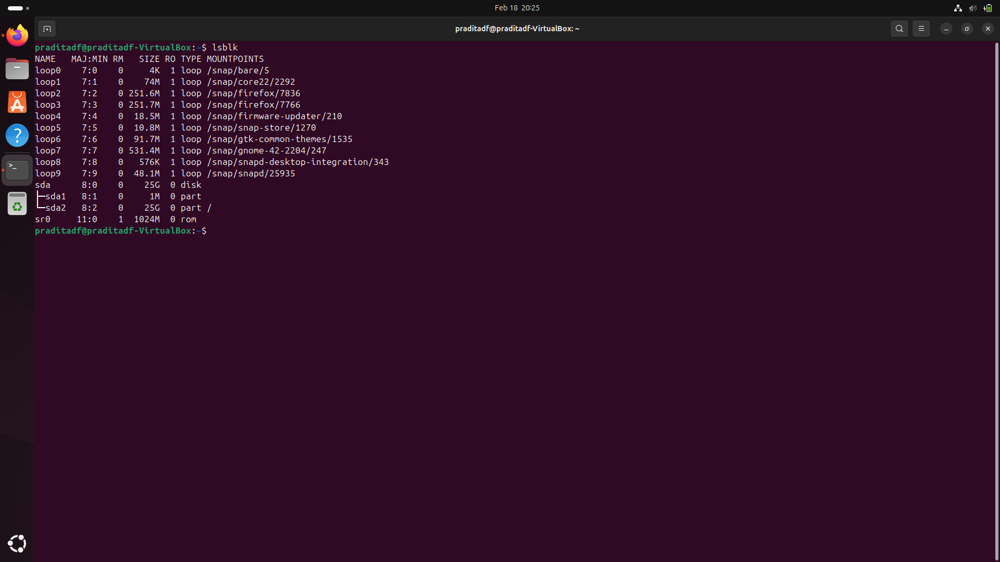
#### 4. ping -c 4 google.com
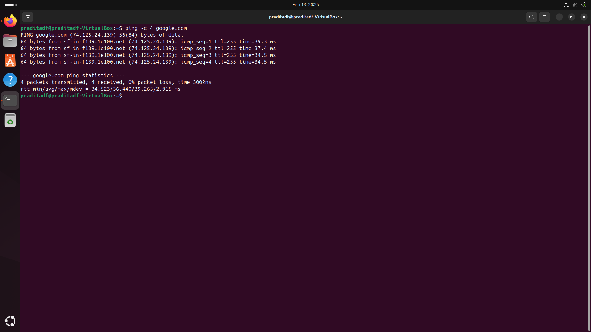
#### 5. sudo apt install htop
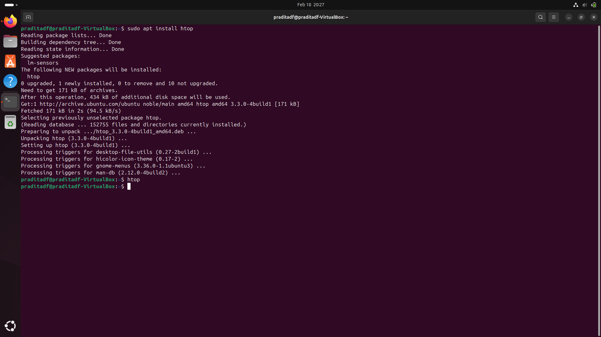
#### 6. htop
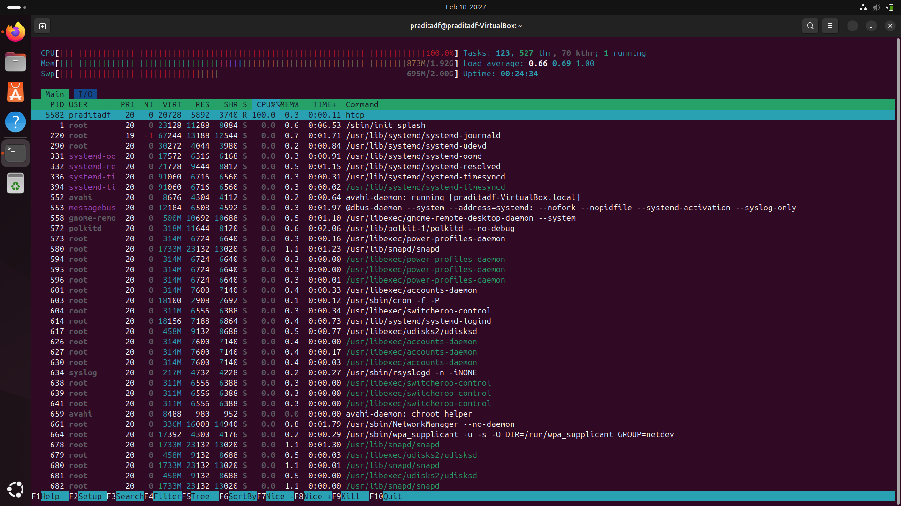

### Latihan 1.6
Ceritakan pengalaman Anda dengan sistem operasi:
1. Sistem operasi apa yang Anda gunakan sehari-hari? (Windows, macOS,
Linux, atau lainnya)
2. Berapa lama Anda menggunakan sistem operasi tersebut?
3. Apa yang Anda sukai dari sistem operasi tersebut?
4. Apa tantangan atau masalah yang pernah Anda hadapi?
5. Apakah Anda pernah menggunakan sistem operasi lain? Bandingkan
pengalaman Anda.
6. Setelah mempelajari bab ini, apakah ada sistem operasi lain yang ingin
Anda coba? Mengapa?
Tulis refleksi Anda dalam 300-500 kata disertai dengan dokumentasi.

### Jawaban Latihan 1.6
