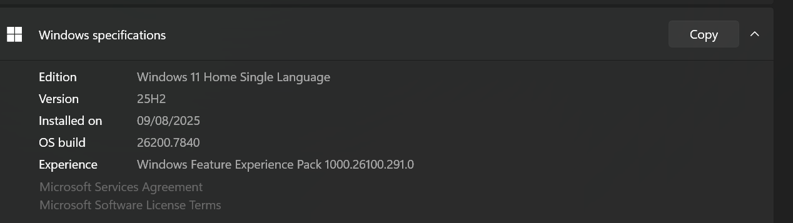
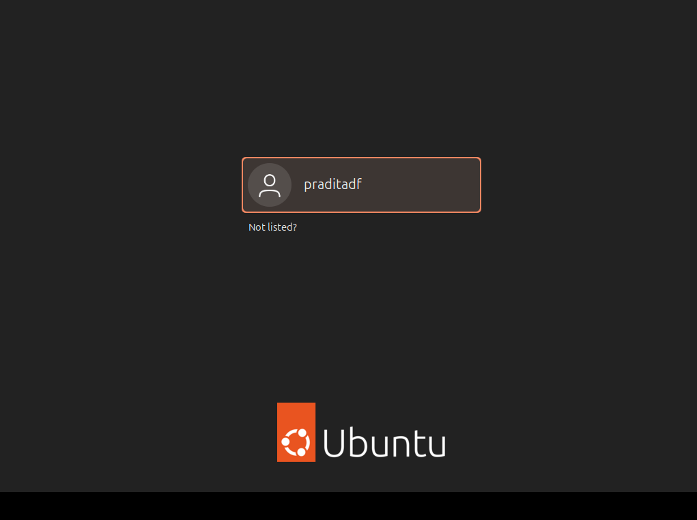

# Pengenalan Sistem Operasi & Instalasi

## 1.10. Latihan

### Latihan 1.1
Jelaskan 5 fungsi utama sistem operasi dengan contoh konkret dari minimal 2 OS berbeda (Windows, macOS, atau Linux).

#### Process Management
Sistem operasi bertugas untuk menentukan proses mana yang mendapat CPU time, membuat dan mengakhiri proses, mengkoordinasi multiple processes, dan memfasilitasi komunikasi antar proses. Contoh :
* Windows : Task Manager menampilkan proses yang berjalan dan penggunaan sumber daya
* Linux: Perintah ps, top, dan htop untuk memantau proses

#### Memory Management
Sistem operasi berfungsi untuk memberikan memori ke proses yang membutuhkan, menggunakan disk untuk extension dari RAM, mencegah satu proses mengakses memori proses lain, serta teknik untuk optimasi penggunaan memori. Contoh:
* Pagefile di Windows : Ketika RAM penuh, sistem operasi memindahkan sebagian data ke disk sehingga aplikasi dapat terus berjalan,
meskipun dengan kinerja yang lebih lambat.

#### File Management
Sistem operasi berfungsi sebagai file management, yaitu membuat, membaca, menulis, menghapus file, mengintegrasikan perangkat penyimpanan ke sistem
Contoh file systems:
* Windows: NTFS (New Technology File System)
* macOS: APFS (Apple File System)
* Linux: ext4, XFS, Btrfs

#### I/O Management
Sistem operasi merupakan perangkat lunak untuk berkomunikasi dengan perangkat keras, penyimpanan sementara untuk kelancaran operasi I/O, merespon sinyal dari perangkat keras, antrean untuk perangkat seperti printer.

#### Security dan Protection
Sistem operasi berfungsi sebagai verifikasi identitas pengguna, kontrol ke akses sumber daya berdasarkan izin, Proteksi data (BitLocker di Windows, FileVault di macOS), dan pencatatan aktivitas sistem untuk pemantauan keamanan.

### Latihan 1.2
Kapan sebaiknya menggunakan Windows vs Linux vs macOS? Analisis
berdasarkan use case: gaming, development, server, creative work, dan enterprise.
* Gaming           : Windows adalah pilihan terbaik untuk gaming karena memiliki kompatibilitas yang luas dengan game-game populer, driver grafis yang lebih baik, dan dukungan untuk teknologi seperti DirectX.
* Development      : Linux adalah pilihan terbaik untuk development karena memiliki banyak tool development yang gratis dan open-source, serta fleksibilitas yang tinggi. Linux juga memungkinkan developer untuk memiliki kontrol penuh atas sistem operasi.
* Server           : Linux adalah pilihan terbaik untuk server karena memiliki keamanan yang tinggi, fleksibilitas yang tinggi, dan biaya yang rendah. Linux juga memiliki banyak distribusi yang dioptimalkan untuk server.
* Creative work    : macOS adalah pilihan terbaik untuk creative work karena memiliki aplikasi-aplikasi kreatif yang sangat baik seperti Final Cut Pro dan Logic Pro, serta memiliki antarmuka yang intuitif dan mudah digunakan.
* enterprise       : Windows adalah pilihan terbaik untuk enterprise karena memiliki kompatibilitas yang luas dengan aplikasi-aplikasi bisnis, dukungan yang baik dari Microsoft, dan memiliki fitur keamanan yang kuat seperti Active Directory.

### Latihan 1.3
Install Ubuntu Server 22.04 LTS di VirtualBox dengan langkah berikut:
1. Download Ubuntu Server ISO dari website resmi
2. Create VM baru di VirtualBox (RAM: 2GB, Disk: 25GB)
3. Install dengan automatic partitioning (guided)
4. Buat user account dengan password yang kuat
5. Reboot dan login ke sistem
6. Dokumentasikan proses instalasi dengan screenshot key steps

### Install Ubuntu Server 22.04 LTS di VirtualBox

### Latihan 1.4
Setelah instalasi Ubuntu Server, lakukan tasks berikut:
1. Update package list: sudo apt update
2. Upgrade packages: sudo apt upgrade
3. Install neofetch: sudo apt install neofetch
4. Jalankan neofetch dan screenshot hasilnya
5. Check disk usage dengan df -h
6. Check memory dengan free -h
7. Dokumentasikan output dari setiap command

### Dokumentasi Latihan 1.4

#### 1. sudo apt update

#### 2. sudo apt upgrade

#### 3. sudo apt install neofetch

#### 4. neofetch

#### 5. df -h

#### 6. free -h

### Latihan 1.5
Eksplorasi sistem yang baru diinstall:
1. Tampilkan informasi OS: cat /etc/os-release
2. Tampilkan versi kernel: uname -r
3. List partisi: lsblk
4. Check network connectivity: ping -c 4 google.com
5. Install dan jalankan htop untuk melihat resource usage
6. Buat laporan singkat tentang konfigurasi sistem Anda

### Laporan Latihan 1.5

#### 1. cat /etc/os-release

#### 2. uname -r

#### 3. lsblk

#### 4. ping -c 4 google.com

#### 5. sudo apt install htop

#### 6. htop

### Latihan 1.6
Ceritakan pengalaman Anda dengan sistem operasi:
1. Sistem operasi apa yang Anda gunakan sehari-hari? (Windows, macOS, Linux, atau lainnya)  Sistem operasi yang saya gunakan sehari-hari adalah windows. Saya menggunakan windows untuk keperluan sehari-hari saya terutama untuk menunjang aktivitas perkuliahan.
2. Berapa lama Anda menggunakan sistem operasi tersebut? Saya sudah menggunakan sistem operasi windows selama lebih dari 2 tahun, semenjak pertama kali saya memakai sistem operasi pada komputer.
3. Apa yang Anda sukai dari sistem operasi tersebut? Saya menyukai windows karena sistem operasi ini mudah digunakan, dipelajari, dan dipahami, bahkan bagi seorang pemula sekalipun. Selain itu, saya juga terbantu karena sudah langsung mendapatkan lisensi windows yang sudah aktif sejak pertama kali saja memakai perangkat ini.
5. Apa tantangan atau masalah yang pernah Anda hadapi? Tantangan yang pernah saya hadapi adalah ketika laptop saya tiba-tiba mengalami bluescreen, dan laptop mati tidak bisa dinyalakan lagi selama beberapa menit. Saat tombol daya ditekan, mesinnya hanya menyala sebentar tanpa menampilkan gambar apa pun di layar, kemudian mati lagi.
6. Apakah Anda pernah menggunakan sistem operasi lain? Bandingkan
pengalaman Anda.  Saya baru mencoba menggunakan linux untuk pembelajaran mata kuliah sistem operasi. Jika dibandingkan dengan windows, linux terasa lebih susah dikarenakan semua program nya harus manual. namun dengan belajar hal tersebut saya sedikit memahami bagaimana sistem operasi bekerja.
7. Setelah mempelajari bab ini, apakah ada sistem operasi lain yang ingin
Anda coba? Mengapa?
Setelah mempelajari bab ini, saya ingin terus mempelajari sistem operasi yang belum pernah saya coba sebelumnya, terutama linux. Selain sistem operasi ini sangat mendukung untuk development dan juga jauh lebih ringan dibanding sistem operasi yang lainnya.

