# Pengenalan Sistem Operasi & Instalasi

## 1.10. Latihan

### Latihan 1.1
Jelaskan 5 fungsi utama sistem operasi dengan contoh konkret dari minimal 2 OS berbeda (Windows, macOS, atau Linux).

#### Process Management
Sistem operasi bertugas untuk menentukan proses mana yang mendapat CPU time, membuat dan mengakhiri proses, mengkoordinasi multiple processes, dan memfasilitasi komunikasi antar proses. Contoh :
* Windows : Task Manager menampilkan proses yang berjalan dan penggunaan sumber daya
* Linux: Perintah ps, top, dan htop untuk memantau proses

#### Memory Management
Sistem operasi berfungsi untuk memberikan memori ke proses yang membutuhkan, menggunakan disk untuk extension dari RAM, mencegah satu proses mengakses memori proses lain, serta teknik untuk optimasi penggunaan memori. Contoh:
* Pagefile di Windows : Ketika RAM penuh, sistem operasi memindahkan sebagian data ke disk sehingga aplikasi dapat terus berjalan,
meskipun dengan kinerja yang lebih lambat.

#### File Management
Sistem operasi berfungsi sebagai file management, yaitu membuat, membaca, menulis, menghapus file, mengintegrasikan perangkat penyimpanan ke sistem
Contoh file systems:
* Windows: NTFS (New Technology File System)
* macOS: APFS (Apple File System)
* Linux: ext4, XFS, Btrfs

#### I/O Management
Sistem operasi merupakan perangkat lunak untuk berkomunikasi dengan perangkat keras, penyimpanan sementara untuk kelancaran operasi I/O, merespon sinyal dari perangkat keras, antrean untuk perangkat seperti printer.

#### Security dan Protection
Sistem operasi berfungsi sebagai verifikasi identitas pengguna, kontrol ke akses sumber daya berdasarkan izin, Proteksi data (BitLocker di Windows, FileVault di macOS), dan pencatatan aktivitas sistem untuk pemantauan keamanan.

### Latihan 1.2
Kapan sebaiknya menggunakan Windows vs Linux vs macOS? Analisis
berdasarkan use case: gaming, development, server, creative work, dan enterprise.
* Gaming
* Development
* Server
* Creative work
* enterprise

### Latihan 1.3
Install Ubuntu Server 22.04 LTS di VirtualBox dengan langkah berikut:
1. Download Ubuntu Server ISO dari website resmi
2. Create VM baru di VirtualBox (RAM: 2GB, Disk: 25GB)
3. Install dengan automatic partitioning (guided)
4. Buat user account dengan password yang kuat
5. Reboot dan login ke sistem
6. Dokumentasikan proses instalasi dengan screenshot key steps

### Install Ubuntu Server 22.04 LTS di VirtualBox
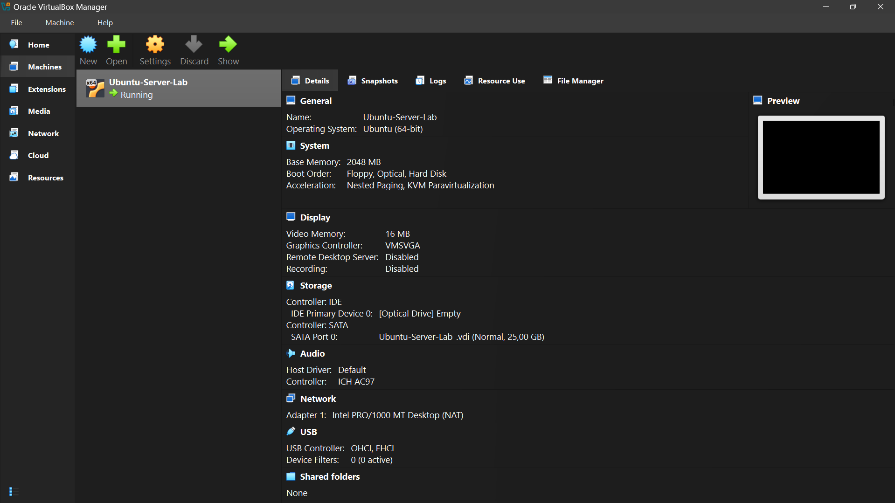
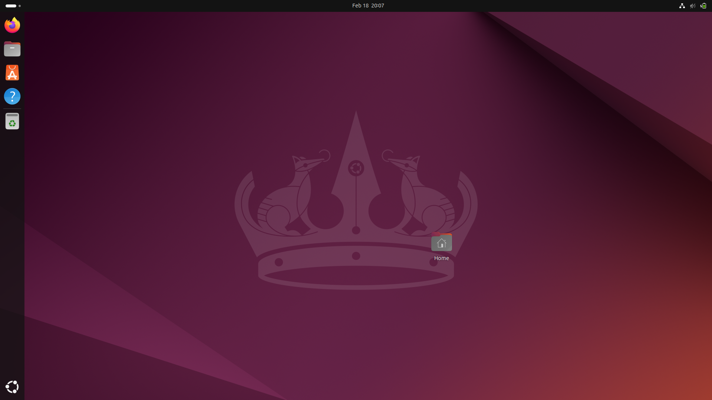

### Latihan 1.4
Setelah instalasi Ubuntu Server, lakukan tasks berikut:
1. Update package list: sudo apt update
2. Upgrade packages: sudo apt upgrade
3. Install neofetch: sudo apt install neofetch
4. Jalankan neofetch dan screenshot hasilnya
5. Check disk usage dengan df -h
6. Check memory dengan free -h
7. Dokumentasikan output dari setiap command

### Dokumentasi Latihan 1.4

#### 1. sudo apt update
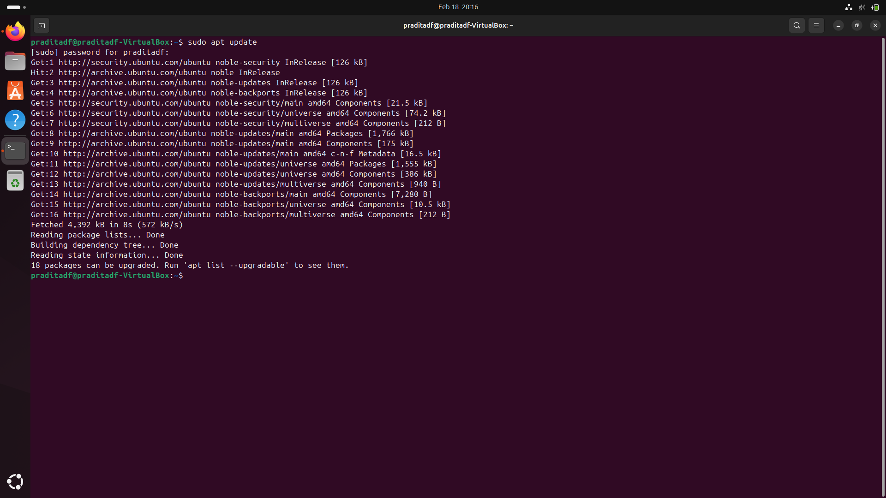
#### 2. sudo apt upgrade
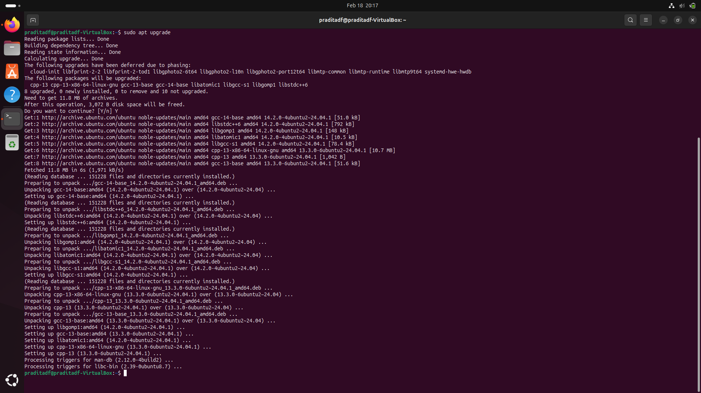
#### 3. sudo apt install neofetch
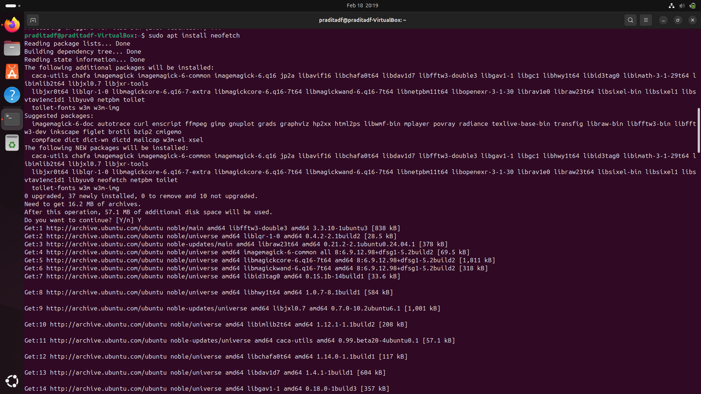
#### 4. neofetch
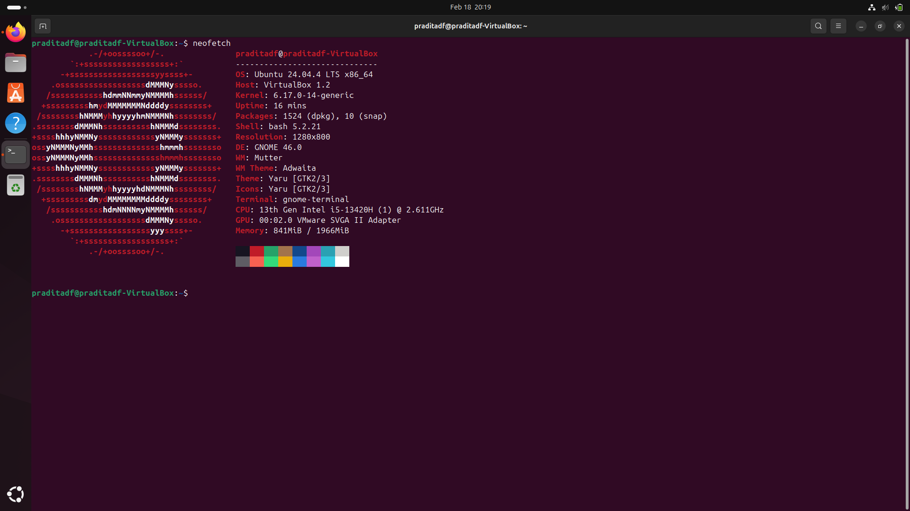
#### 5. df -h
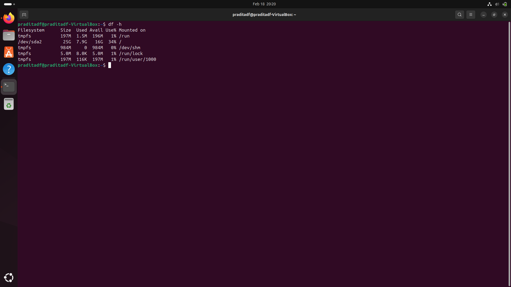
#### 6. free -h
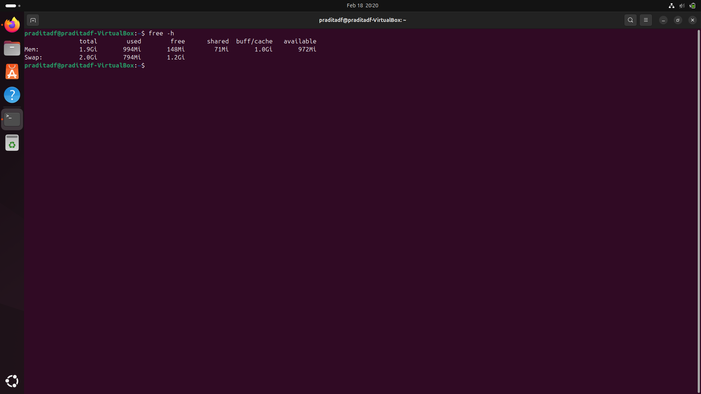

### Latihan 1.5
Eksplorasi sistem yang baru diinstall:
1. Tampilkan informasi OS: cat /etc/os-release
2. Tampilkan versi kernel: uname -r
3. List partisi: lsblk
4. Check network connectivity: ping -c 4 google.com
5. Install dan jalankan htop untuk melihat resource usage
6. Buat laporan singkat tentang konfigurasi sistem Anda

### Laporan Latihan 1.5

#### 1. cat /etc/os-release
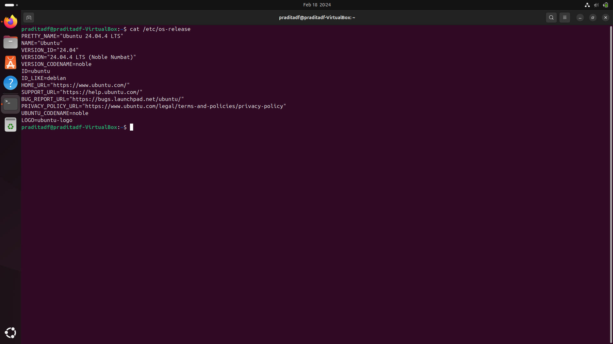
#### 2. uname -r
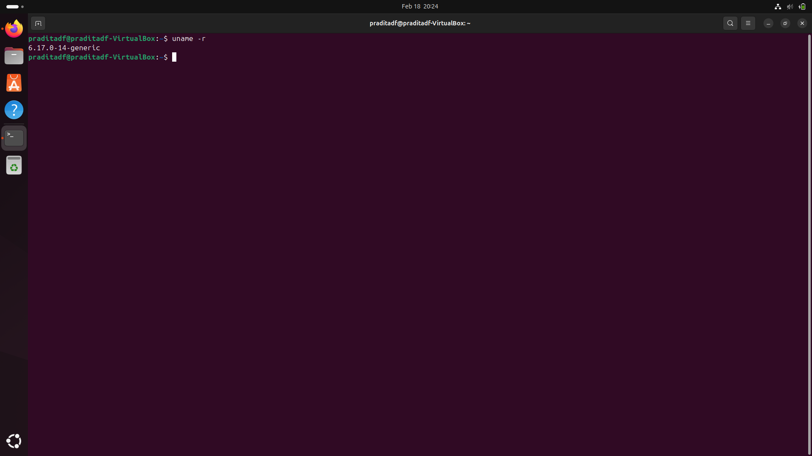
#### 3. lsblk
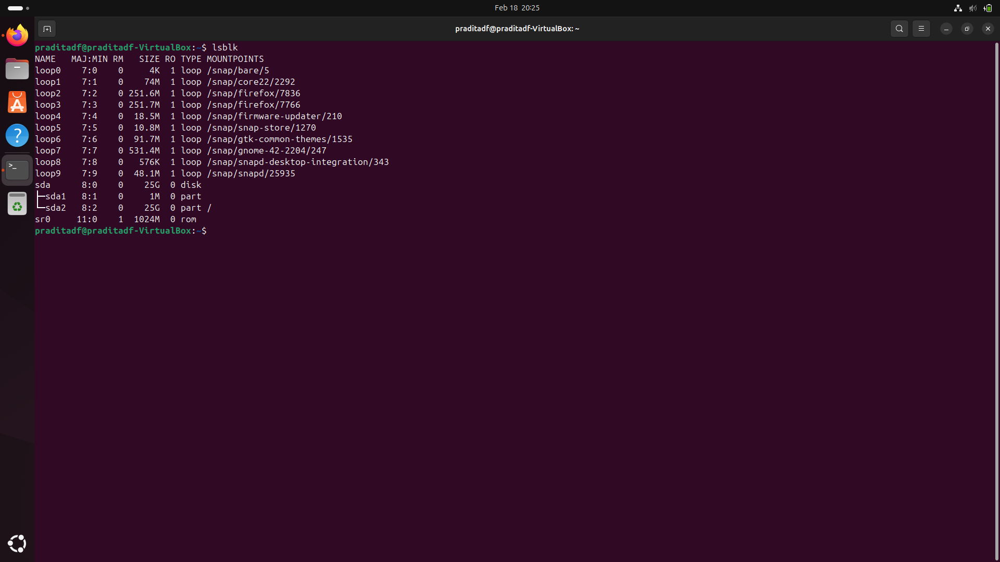
#### 4. ping -c 4 google.com
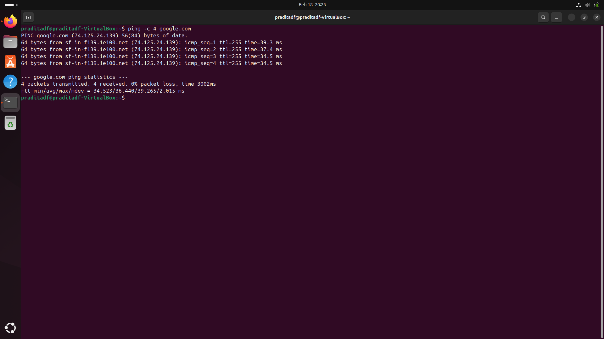
#### 5. sudo apt install htop
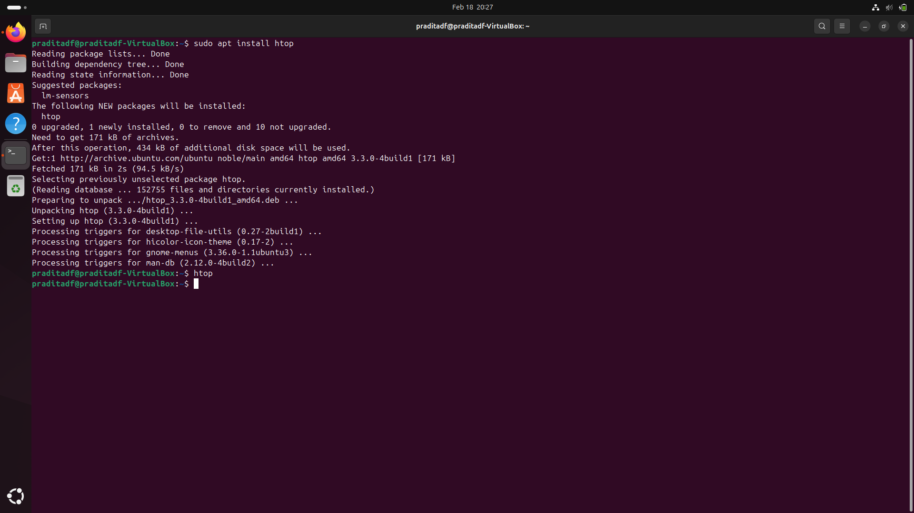
#### 6. htop
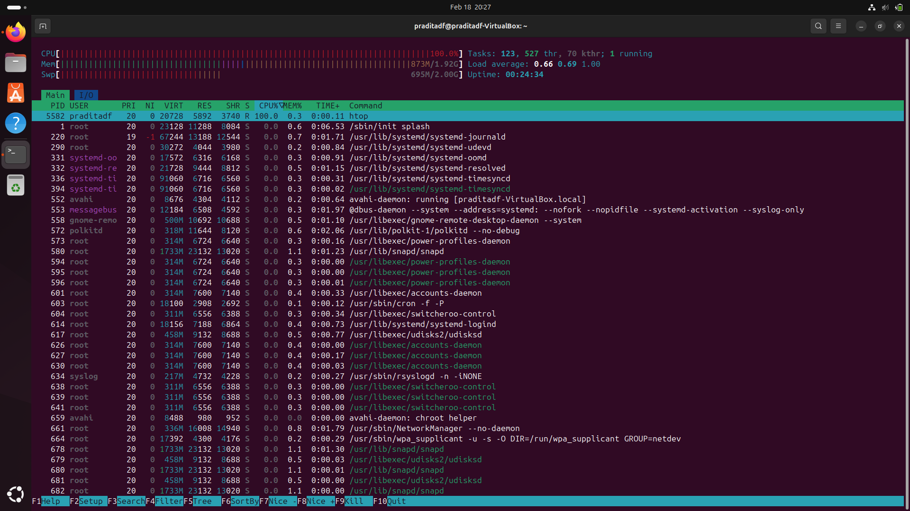

### Latihan 1.6
Ceritakan pengalaman Anda dengan sistem operasi:
1. Sistem operasi apa yang Anda gunakan sehari-hari? (Windows, macOS,
Linux, atau lainnya)
2. Berapa lama Anda menggunakan sistem operasi tersebut?
3. Apa yang Anda sukai dari sistem operasi tersebut?
4. Apa tantangan atau masalah yang pernah Anda hadapi?
5. Apakah Anda pernah menggunakan sistem operasi lain? Bandingkan
pengalaman Anda.
6. Setelah mempelajari bab ini, apakah ada sistem operasi lain yang ingin
Anda coba? Mengapa?
Tulis refleksi Anda dalam 300-500 kata disertai dengan dokumentasi.

### Jawaban Latihan 1.6
