# Manajemen Perangkat Keras & Perintah Dasar Sistem Operasi

## Praktikum 2.1 — Identifikasi CPU dan Memori

### 1. Tampilkan informasi CPU:
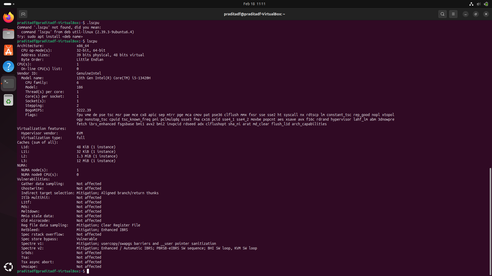

### 2. Tampilkan ringkasan memori:


### 3. Cek informasi hardware dari DMI/BIOS (butuh sudo):


## Latihan 2.1
Catat: (1) jumlah CPU(s), core/thread, (2) total RAM, (3) total swap. Jelaskan perbedaan RAM vs swap dalam 2–3 kalimat.
### Catat: (1) jumlah CPU(s), core/thread
```
CPU(s)               : 1
Tread(s) per core    : 1
Core(s) per socket   : 1
Socket(s)            : 1
```

### (2) total RAM
```
Mem                  : 1.9Gi
```

### (3) total swap. Jelaskan perbedaan RAM vs swap dalam 2–3 kalimat.
```
Swap                 : 2.0Gi
Perbedaan Ram dan scap adalah...
```

## Praktikum 2.2 — Identifikasi Perangkat PCI/USB dan Driver


### 1. Lihat daftar perangkat PCI:
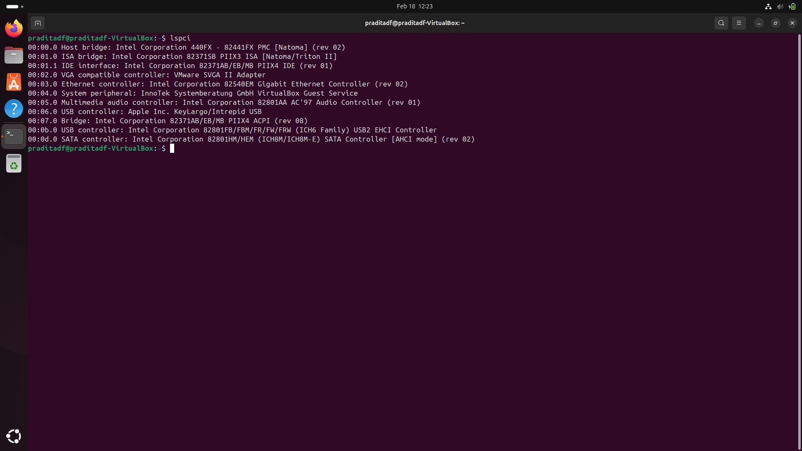

### 2. Lihat perangkat PCI beserta driver kernel yang digunakan:
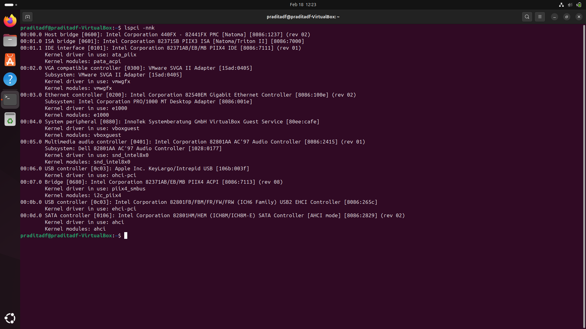

### 3. Fokus pada NIC (Ethernet) untuk mencari modul driver:
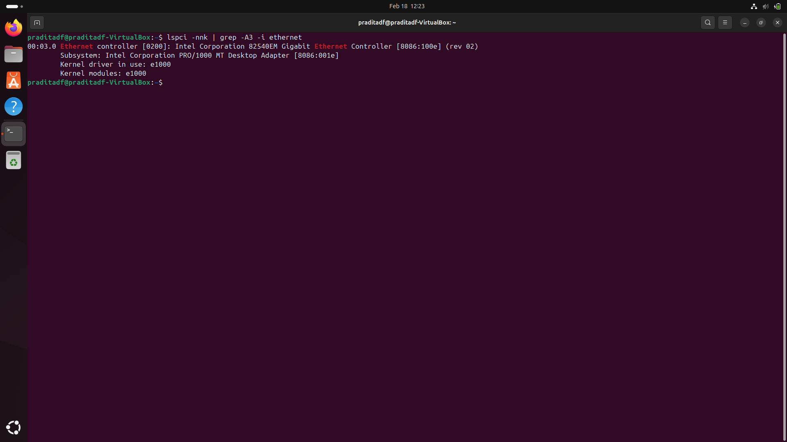

### 4. Lihat perangkat USB:
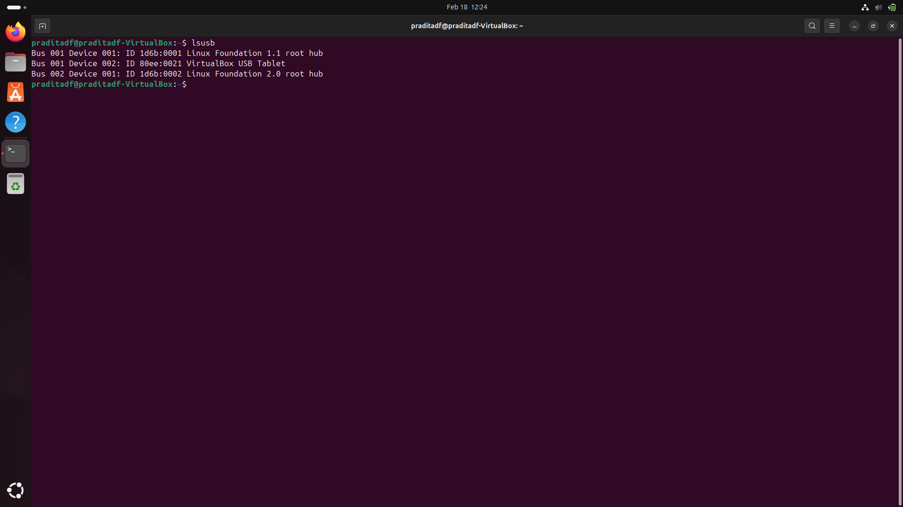

### 5. Lihat topologi USB (tree):
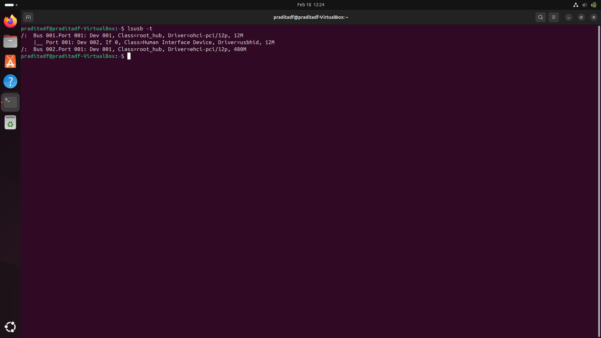

## Latihan 2.2
Temukan 1 perangkat PCI (misal NIC) dan tuliskan: Vendor:Device ID (angka heksadesimal), nama driver/modul kernel, dan deskripsi singkat fungsinya.


## Praktikum 2.3 — Identifikasi Storage dan Filesystem

### 1.  Lihat daftar disk/partisi:
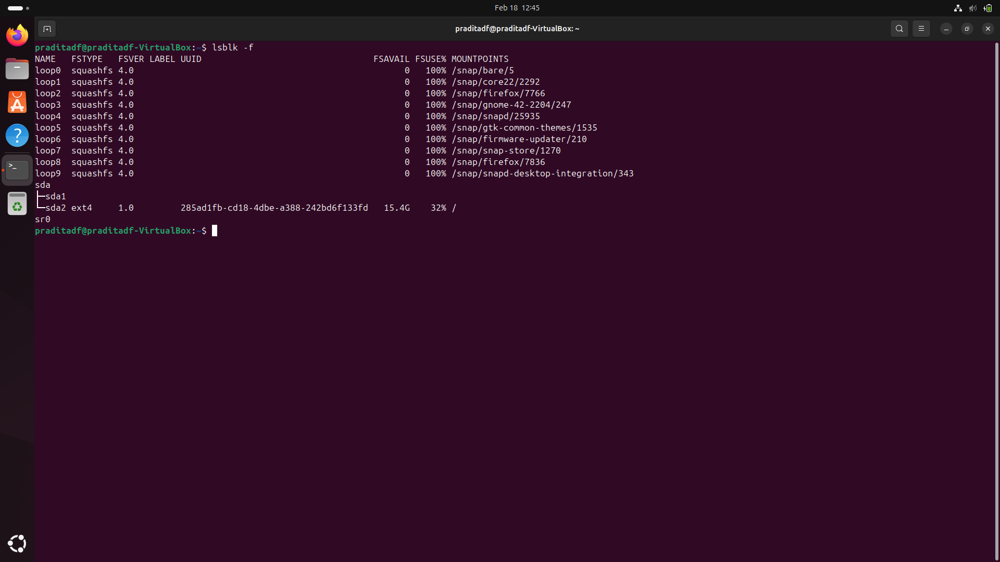

### 2. Tampilkan UUID dan tipe filesystem:
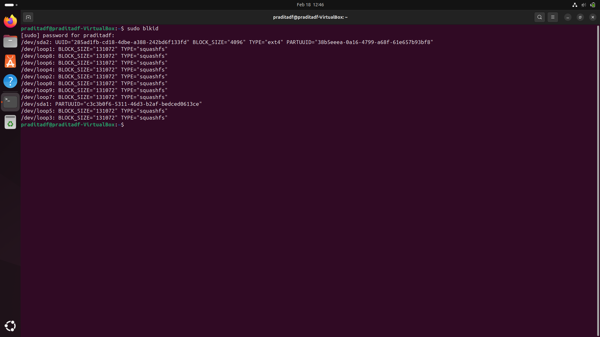

### 3. Lihat mount point untuk root filesystem:
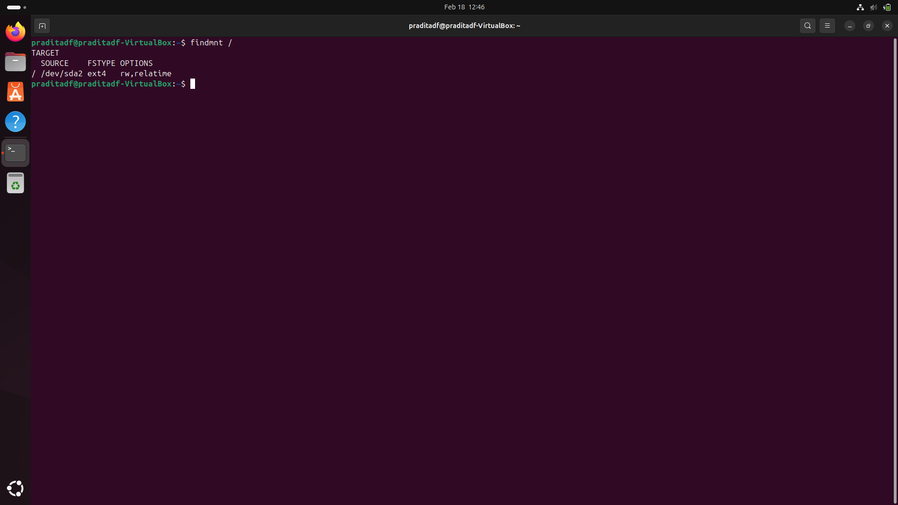


## Praktikum 2.4 — Melihat Modul Aktif dan Informasinya

### 1. Cek versi kernel:
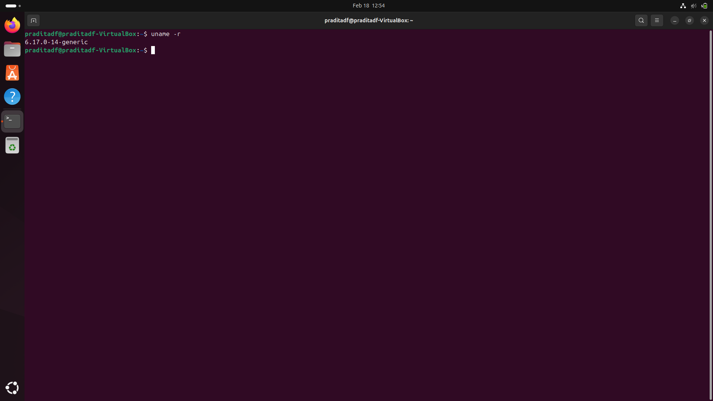

### 2. Tampilkan daftar modul aktif:
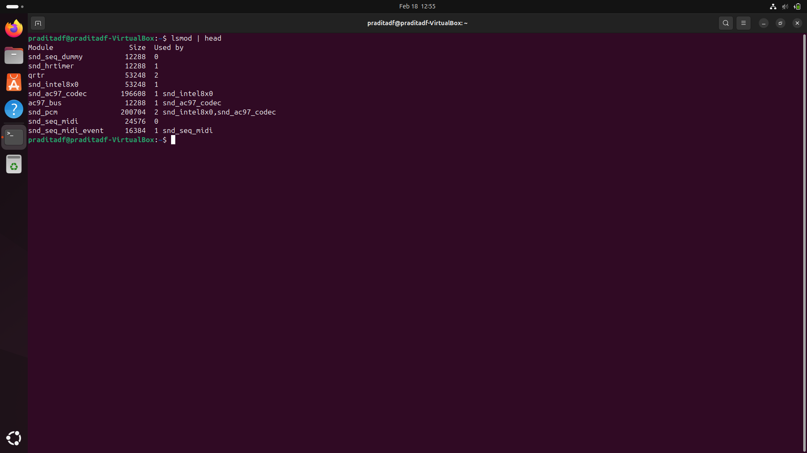

### 3. Pilih salah satu modul (contoh aman: loop) dan lihat detailnya:
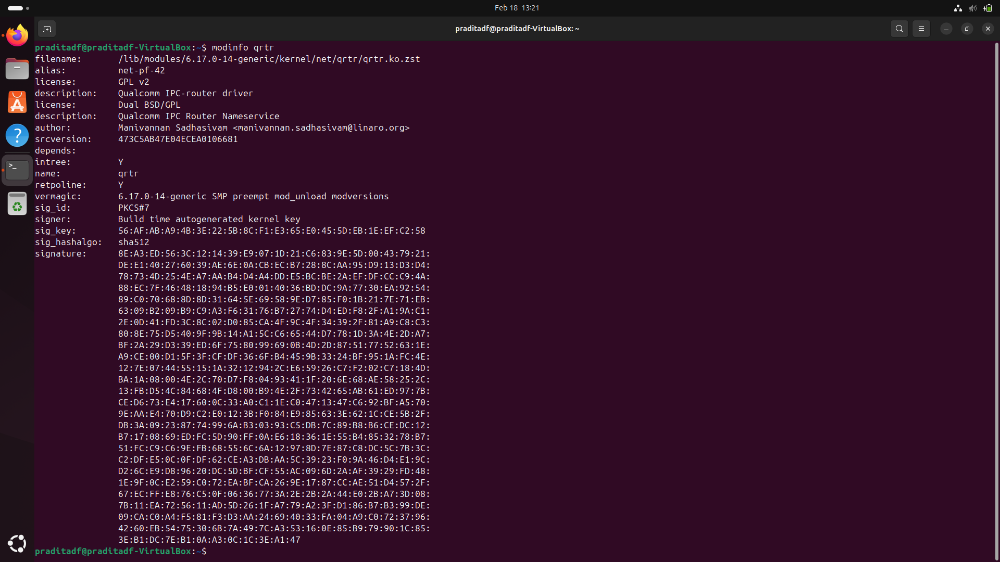

### 4. Muat modul (jika belum aktif), lalu verifikasi:
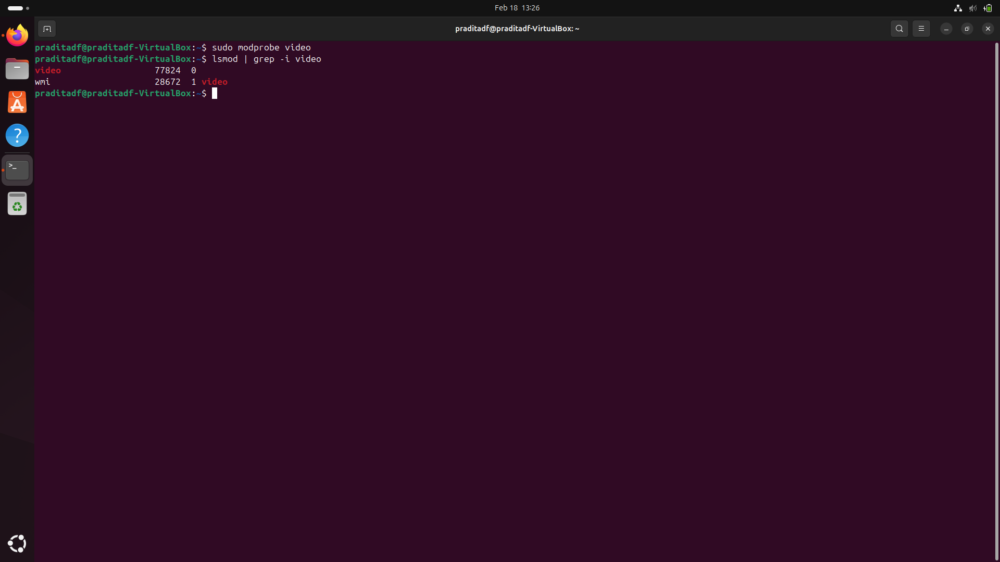


## Praktikum 2.5 — Konfigurasi Auto-load dan Blacklist

### 1. Buat file auto-load: 


### 2. Simulasikan verifikasi (tanpa reboot) dengan memastikan modul sudah aktif:
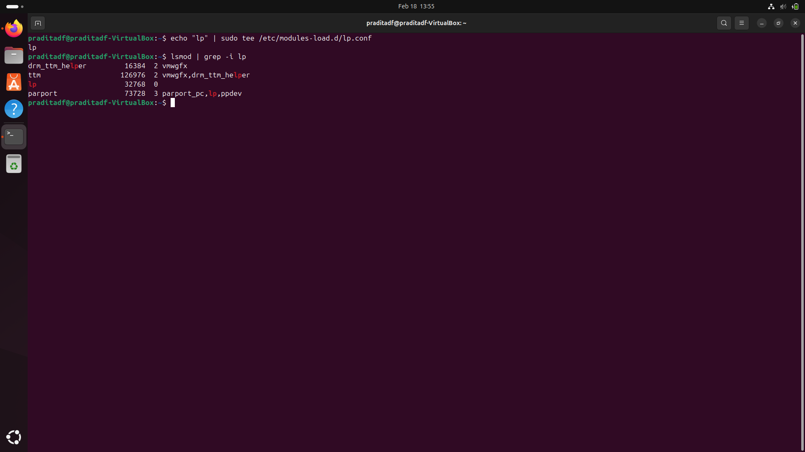

### 3. (Opsional, konsep) blacklist modul:
```
# echo " blacklist loop " | sudo tee / etc/ modprobe .d/blacklist - loop . conf
```


## Praktikum 2.6

### 1. Lihat detail salah satu disk (sesuaikan dengan perangkat Anda, misal sda):


### 2. Lihat detail device terminal:


### 3. Lihat disk dan partisi untuk mengaitkan dengan /dev:


## Latihan 2.3


## Praktikum 2.7

### 1. 


### 2. 


### 3. 


## Praktikum 2.8

### 1. 


### 2. 


### 3. 


## Praktikum 2.9

### 1. 


### 2. 


### 3. 


## Latihan 2.4


## Praktikum 2.10

### 1. 


### 2. 


### 3. 


## Praktikum 2.11

### 1. 


### 2. 


### 3. 


## Praktikum 2.12

### 1. 


### 2. 


### 3. 


## Praktikum 2.13

### 1. 


### 2. 


### 3. 


## Praktikum 2.14

### 1. 


### 2. 


### 3. 


## Praktikum 2.15

### 1. 


### 2. 


### 3. 


## Praktikum 2.16

### 1. 


### 2. 


### 3. 


## Latihan 2.5
Pilih satu port yang listening dari output ss -tulpn(misal port 22), lalu tuliskan service/proses yang membukanya. Jelaskan kegunaan port tersebut secara singkat.


